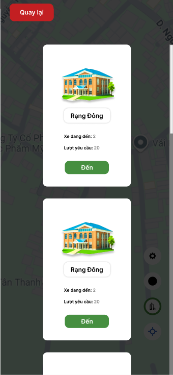
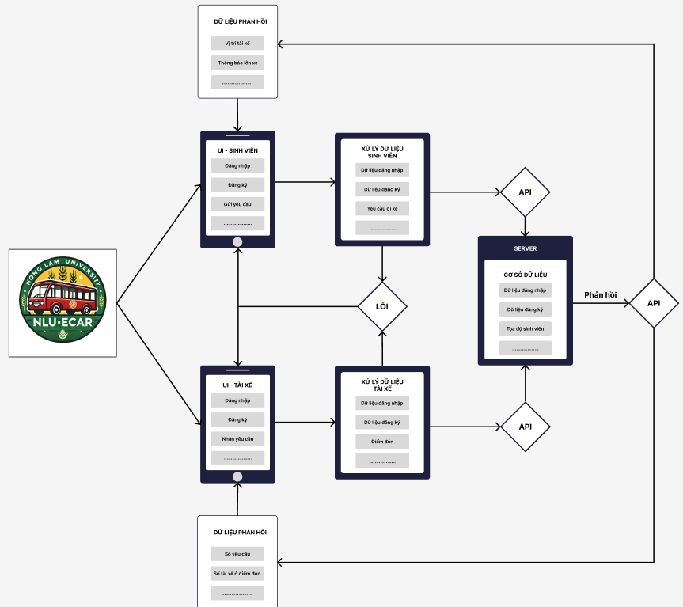

# Cloud Computing Project (Đồ án điện toán đám mây)
## Đề tài : **Ứng dụng hệ thống đám mây Google Cloud phát triển ứng dụng xe điện Nông Lâm NLU-ECAR**

**_NLU-ECAR (Nong Lam University Electric Car):_** là một website được phát triển để hỗ trợ sinh viên Trường Đại Học Nông Lâm Thành Phố Hồ Chí Minh có thể tiếp cận dịch vụ xe điện của trường một cách dễ dàng và giúp các tài xế đưa đón sinh viên một cách thuận lợi và nhanh chóng.

### NLU-ECAR giải quyết điều gì?
-Sự bất tiện khi di chuyển giữa các giảng đường của sinh viên.
-Sự bất tiện khi di chuyển trong khuôn viên trường vào những thời điểm nắng gắt và mưa bão
-Sự phân vân của tài xế trong việc lựa chọn điểm đến tiếp theo.

### Lợi ích của NLU-ECAR
-Sinh viên có thể gửi yêu cầu đi xe đến tài xế một cách dễ dàng và nhanh chóng.
-Sinh viên có thể theo dõi được vị trí của tài xế.
-Tài xế có thể nhận được yêu cầu đi xe một cách dễ dàng và nhanh chóng.

### Ý tưởng ban đầu của NLU-ECAR
Đối tượng sinh viên: 
- NLU-ECAR sẽ thông qua định vị GPS của thiết bị để thu thập vị trí của sinh viên. 
- Dựa trên vị trí thu thập được sẽ xác định sinh viên đang ở giảng đường nào (Mỗi giảng đường được xem là một trạm xe điện). 
-   Sau đó sẽ gửi yêu cầu đi xe đến tài xế.
-   Sinh viên có thể hủy yêu cầu đi xe.

Đối tượng tài xế: 
-   NLU-ECAR sẽ hiển thị số lượng yêu cầu đi xe điện của mõi giảng đường. 
-   Tài xế có thể xác định được giảng đường nào đang có nhiều yêu cầu đi xe điện nhất.
-   Sau đó tài xế chọn điểm đến thì:
    -   Hệ thống sẽ khoanh vùng điểm đón cho tài xế.
    -   Sinh viên ở điểm đón sẽ nhìn thấy được vị trị hiện tại của tài xế.
-   Tài xế có thể hủy nhận yêu cầu.

**Hình ảnh**





## Tính năng chính
- Sinh viên
    - Đăng nhập
    - Đăng ký
    - Đăng xuất
    - Đặt xe
    - Hủy đặt xe
    - Theo dõi xe (Kích hoạt khi có tài xế đang đến điểm đón)
- Tài xế
    - Đăng nhập
    - Đăng ký
    - Đăng xuất
    - Nhận đặt xe
    - Hủy nhận đặt xe
    - Khoanh vùng điểm đón (Kích hoạt khi tài xế chọn điểm đón)

## Công nghệ sử dụng
- Khoanh vùng
    - [GEOJSON](https://geojson.io/)
- Thiết kế giao diện
    - Figma
- Giao diện
    - HTML
    - CSS
    - JavaScript - Leaflet
- Hệ thống
    - Python - Flask
- Đám mây
    - Google Cloud Platform - Firestore
- Hosting
    - Render

## Cài đặt và Clone dự án
**Bước 1**
- Cài đặt Git: https://git-scm.com/downloads/win
- Clone dự án thông qua git bash.
```bash
git clone https://github.com/TuongDuy-CodeWeb-Newbie/NLU-ECAR.git
```
**Bước 2**
Mở cmd trong folder vừa clone về và chạy lệnh sau.
```bash
cd .\env\Scripts
call activate.bat
cd ..
cd ..
pip install -r requirements.txt
python app.py
```
App sẽ được chạy trên ```http://127.0.0.1:4000```

## Các đường dẫn
- Thiết kế của ứng dụng [NLU-ECAR Figma](https://www.figma.com/file/3683368336833683368336833683368336833683/NLU-ECAR?node-id=0%3A1&t=0123456789abcdefghijklmnopqrstuvwxyz%3A0)
- Ứng dụng demo [NLU-ECAR demo](https://nlu-ecar.onrender.com)